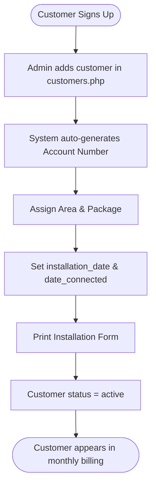
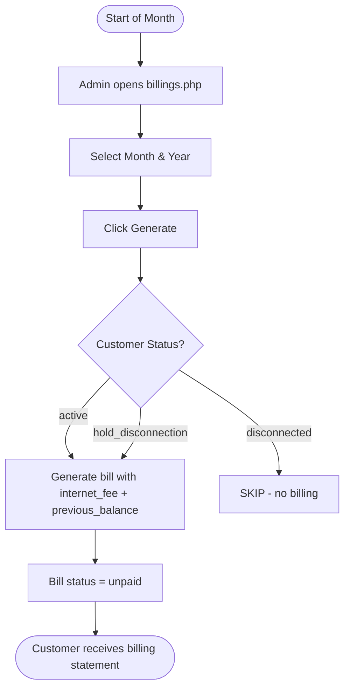
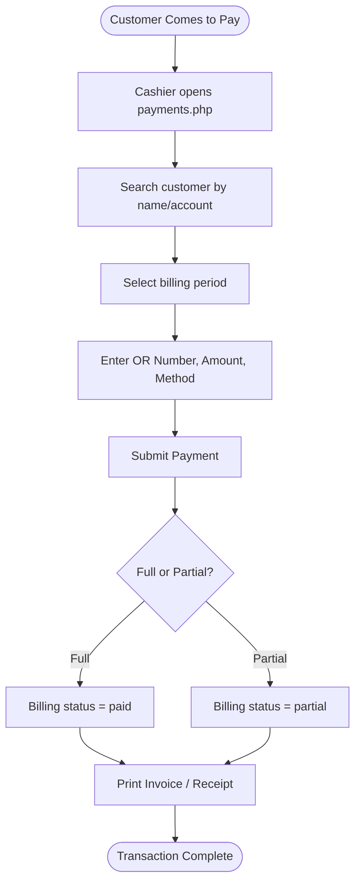
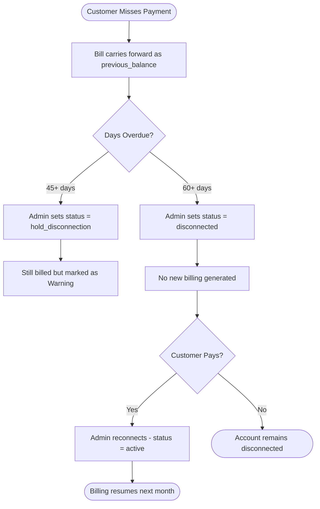
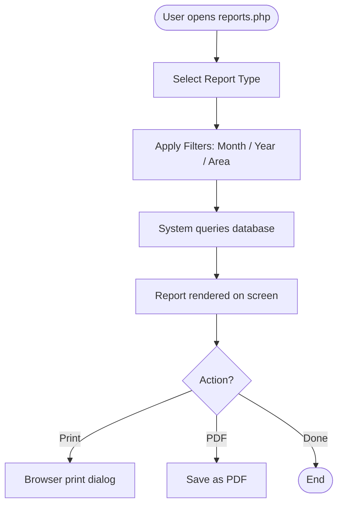

# 📡   NOVALINK BILLING SYSTEM — SYSTEM DOCUMENTATION

> **Version:** 2.0  
> **Company:** NOVA LINK DIGITAL SYSTEMS CORP.  
> **Location:** F. Palmares Street, Passi City, Iloilo  
> **Contact:** 0962-782-9066  
> **Last Updated:** March 2026

---

## Table of Contents

1. [System Overview](#1-system-overview)
2. [Navigation Guide](#2-navigation-guide)
3. [Module Explanation](#3-module-explanation)
4. [Database Overview](#4-database-overview)
5. [Workflow Diagrams](#5-workflow-diagrams)
6. [Missing Features](#6-missing-features)
7. [Future Roadmap](#7-future-roadmap)
8. [User Manual](#8-user-manual)
9. [Developer Notes](#9-developer-notes)

---

## 1. System Overview

The **  NOVALINK Billing System** is a web-based Internet Service Provider (ISP) billing management application. It is designed to handle customer subscriptions, monthly billing generation, payment collection, and financial reporting for NOVA LINK DIGITAL SYSTEMS CORP.

### What the System Does

| Capability | Description |
|---|---|
| **Customer Management** | Create, update, and track subscriber records |
| **Billing Generation** | Auto-generate monthly bills with balance carryover |
| **Payment Collection** | Record payments and issue official receipts (OR) |
| **Financial Reporting** | Sales, billing, and unpaid accounts reports |
| **User Access Control** | Role-based permissions (Admin / Accounting / Cashier) |
| **Installation Records** | Print installation forms with equipment lists |
| **Bulk Printing** | Print billing statements in batch by area |
| **Settings & Configuration** | Manage packages, areas, reminders, and system info |

### Technology Stack

| Component | Technology |
|---|---|
| **Backend** | PHP 7.4+ |
| **Database** | MySQL 5.7+ (MariaDB compatible) |
| **Frontend** | HTML5, CSS3, Vanilla JavaScript |
| **Server** | Apache (XAMPP recommended) |
| **Timezone** | Asia/Manila (Philippine Standard Time) |
| **Character Set** | UTF-8 MB4 (supports Filipino characters) |

### System Identity

- **Application Name:**   NOVALINK Billing System
- **Database:** `ar_novalink_billing`
- **App Version:** 2.0 (v1.0 initial, v2.0 with upgrade schema)
- **Entry Point:** `login.php` → `index.php` (Dashboard)

---

## 2. Navigation Guide

The system uses a **persistent left sidebar** for navigation. Pages shown depend on the user's role.

### Full Navigation Map

```
LOGIN (login.php)
│
└── DASHBOARD (index.php)                    [All Roles]
    ├── Customers (customers.php)             [All Roles]
    │   ├── Add/Edit Customer                 [Admin only]
    │   ├── View Ledger (customer_ledger.php) [All Roles]
    │   └── Disconnect/Reconnect              [Admin only]
    │
    ├── Payments (payments.php)               [Admin, Cashier]
    │   ├── Record Payment
    │   ├── Print Invoice (print_invoice.php)
    │   └── Print Receipt (print_receipt.php)
    │
    ├── Billings (billings.php)               [Admin, Accounting]
    │   ├── Generate Monthly Billing
    │   ├── View Billing Records
    │   └── Print Billing Statement (print_billing_statement.php)
    │
    ├── Unpaid Bills (unpaid.php)             [Admin, Accounting]
    │
    ├── Reports (reports.php)                 [Admin, Accounting]
    │   ├── Monthly Billing Report (monthly_billing_report.php)
    │   ├── Monthly Sales Report (monthly_sales_report.php)
    │   ├── Unpaid Accounts Report (unpaid_accounts_report.php)
    │   ├── For Disconnection Report (for_disconnection_report.php)
    │   └── Last Payment Report (last_payment_report.php)
    │
    ├── User Management (users.php)           [Admin only]
    ├── Manage Areas (manage_areas.php)       [Admin only]
    ├── Manage Packages (manage_packages.php) [Admin only]
    ├── Bulk Print (bulk_print.php)           [Admin only]
    └── Settings (settings.php)              [Admin only]
```

### Role-Based Sidebar Visibility

| Sidebar Item | Admin | Accounting | Cashier |
|---|:---:|:---:|:---:|
| Dashboard | ✅ | ✅ | ✅ |
| Customers | ✅ | ✅ | ✅ |
| Payments | ✅ | ❌ | ✅ |
| Billings | ✅ | ✅ | ❌ |
| Unpaid Bills | ✅ | ✅ | ❌ |
| Reports | ✅ | ✅ | ❌ |
| User Management | ✅ | ❌ | ❌ |
| Manage Areas | ✅ | ❌ | ❌ |
| Manage Packages | ✅ | ❌ | ❌ |
| Bulk Print | ✅ | ❌ | ❌ |
| Settings | ✅ | ❌ | ❌ |

---

## 3. Module Explanation

### 3.1 Authentication Module

**Files:** `login.php`, `logout.php`, `config.php`

Handles user login via `username` + `password` with PHP `password_verify()`. Sessions are created upon successful login and all protected pages call `check_permission()` at the top. Logging out destroys the session.

**Key functions in `config.php`:**
- `getDBConnection()` — Opens a MySQLi connection
- `check_permission($role)` — Enforces role-based page access
- `log_activity()` — Records user actions to `activity_logs`
- `sanitize_input()` — Strips/escapes user input
- `format_currency()` — Formats numbers as Philippine Peso (₱)

---

### 3.2 Dashboard Module

**File:** `index.php`

Displays real-time system statistics using SQL aggregation:
- Total Customers
- Active Customers
- Unpaid Bills count
- Monthly Revenue

Also provides **Quick Action** buttons and a Recent Activity feed. *(Note: Activity feed section is still being developed.)*

---

### 3.3 Customer Management Module

**Files:** `customers.php`, `customer_ledger.php`

Core subscriber management. Customers are stored with:
- Auto-generated account numbers (e.g., `ACC-001`)
- Status lifecycle: `active` → `hold_disconnection` → `disconnected` → `reconnected`
- Linked to an **Area** and a **Package**
- Extended fields from v2.0 upgrade: `port_number`, `lcp_number`, `nap_number`, `nap_output`, `fiber_output`, `serial_number`, `mac_address`, `installed_by`

The **Customer Ledger** (`customer_ledger.php`) shows the complete billing/payment history for a single customer.

---

### 3.4 Payments Module

**Files:** `payments.php`, `print_invoice.php`, `print_receipt.php`

Used by Cashiers and Admins to:
- Search for a customer
- Select the billing period
- Enter OR (Official Receipt) number, payment date, amount, and method
- Record the payment and update billing status (`paid` / `partial`)
- Print a printable invoice or receipt

**Payment Methods:** Cash, Check, Online, Others

---

### 3.5 Billings Module

**Files:** `billings.php`, `print_billing_statement.php`, `bulk_print.php`

The billing engine generates monthly charge records for all **active** and **hold_disconnection** customers. Disconnected customers are excluded.

**Billing Logic:**
- Previous unpaid balance is automatically carried forward as `previous_balance`
- Bill = `internet_fee` + `cable_fee` + `service_fee` + `material_fee` + `previous_balance` − `discount`
- Due date = last day of the current month (7-day grace period in practice)
- Each customer can only have one billing record per month (`UNIQUE KEY` constraint)

**Additional Fees** tracked separately in `billing_fees` table: installation, reconnection, adjustment, other.

---

### 3.6 Unpaid Bills Module

**File:** `unpaid.php`

Quick dashboard for all outstanding balances. Filterable by Area, Month, and Year. Uses the `v_unpaid_subscriptions` database view.

**Color-coded urgency:**
- 🟢 Green — Less than 30 days overdue
- 🟡 Yellow — 30–60 days overdue
- 🔴 Red — 60+ days overdue

---

### 3.7 Reports Module

**Files:** `reports.php`, and 5 dedicated report pages

| Report | File | Purpose |
|---|---|---|
| Monthly Billing | `monthly_billing_report.php` | All billings for a given month |
| Monthly Sales | `monthly_sales_report.php` | Revenue by payment method |
| Unpaid Accounts | `unpaid_accounts_report.php` | All customers with balances |
| For Disconnection | `for_disconnection_report.php` | 60+ days overdue / hold customers |
| Last Payment Dates | `last_payment_report.php` | Payment behavior per customer |

All reports are printable/PDF-exportable.

---

### 3.8 User Management Module

**File:** `users.php`

Admin-only module for creating and managing system accounts.

**Roles:**
| Role | Level | Description |
|---|---|---|
| `admin` | Full Access | Can do everything including user management |
| `accounting` | View + Reports | Can view records and generate reports, cannot edit |
| `cashier` | Payment Only | Can record payments and print invoices only |

---

### 3.9 Area Management Module

**File:** `manage_areas.php`

Manages service coverage areas (Barangays/Districts). Areas are linked to customers for filtering and field collection.

---

### 3.10 Package Management Module

**File:** `manage_packages.php`

Manages internet subscription plans. Each package has:
- Name (e.g., Package 1, Package 2)
- Bandwidth (Mbps)
- Monthly Fee (₱)
- Status (active/inactive)
- Associated **installation materials** (`package_materials` table)

---

### 3.11 Bulk Print Module

**File:** `bulk_print.php`

Allows Admin to print billing statements for multiple customers in one action, filtered by area or billing period. Useful for field collection runs.

---

### 3.12 Settings Module

**File:** `settings.php`

Admin-only configuration:
- **Billing Reminder Text** — Custom message printed on billing statements
- **Company Tagline** — Thank-you message at the bottom of statements
- **Change Password** — Secure password update using `password_hash()`
- **System Info Panel** — Shows app version, PHP version, and server time

---

### 3.13 Print Templates

| File | Printed Document |
|---|---|
| `print_billing_statement.php` | Customer billing statement |
| `print_invoice.php` | Official payment invoice |
| `print_receipt.php` | Payment receipt |
| `print_installation.php` | Installation work order form |

---

### 3.14 AJAX Helpers

**Directory:** `ajax/`

| File | Purpose |
|---|---|
| `search_customers.php` | Live customer search dropdown |
| `dashboard_search.php` | Dashboard-wide search |
| `get_customer_billings.php` | Fetch billing periods per customer |
| `get_material_names.php` | Fetch materials list for packages |

---

## 4. Database Overview

**Database name:** `ar_novalink_billing`  
**Engine:** InnoDB | **Charset:** utf8mb4_unicode_ci

### Core Tables

#### `users`
Stores system users (admin, accounting, cashier).

| Column | Type | Description |
|---|---|---|
| `user_id` | INT PK | Auto-increment ID |
| `username` | VARCHAR(50) | Unique login name |
| `password` | VARCHAR(255) | Bcrypt hashed password |
| `full_name` | VARCHAR(100) | Display name |
| `role` | ENUM | `admin`, `accounting`, `cashier` |
| `status` | ENUM | `active`, `inactive` |
| `last_login` | TIMESTAMP | Tracks last access |

---

#### `areas`
Service coverage zones / Barangays.

| Column | Type | Description |
|---|---|---|
| `area_id` | INT PK | Auto-increment ID |
| `area_name` | VARCHAR(100) | Unique area name |
| `description` | TEXT | Optional description |

---

#### `packages`
Internet subscription plans.

| Column | Type | Description |
|---|---|---|
| `package_id` | INT PK | Auto-increment ID |
| `package_name` | VARCHAR(100) | Plan label |
| `bandwidth_mbps` | INT | Speed in Mbps |
| `monthly_fee` | DECIMAL(10,2) | Monthly charge |
| `status` | ENUM | `active`, `inactive` |

---

#### `customers`
Main subscriber records.

| Column | Type | Description |
|---|---|---|
| `customer_id` | INT PK | Auto-increment ID |
| `account_number` | VARCHAR(50) | Unique, e.g., `ACC-001` |
| `subscriber_name` | VARCHAR(150) | Name in LASTNAME, FIRSTNAME format |
| `area_id` | INT FK | References `areas` |
| `package_id` | INT FK | References `packages` |
| `monthly_fee` | DECIMAL(10,2) | Overrides package fee if needed |
| `status` | ENUM | `active`, `disconnected`, `reconnected`, `pending_installation`, `hold_disconnection` |
| `installation_date` | DATE | Date of setup |
| `disconnection_date` | DATE | Date service was stopped |
| `router_serial` | VARCHAR(100) | Equipment serial |
| `port_number` | VARCHAR(50) | Network port (v2.0) |
| `lcp_number` | VARCHAR(50) | LCP reference (v2.0) |
| `nap_number` | VARCHAR(50) | NAP reference (v2.0) |
| `mac_address` | VARCHAR(50) | Device MAC (v2.0) |
| `installed_by` | VARCHAR(100) | Technician name (v2.0) |

---

#### `billings`
Monthly billing records (one per customer per month).

| Column | Type | Description |
|---|---|---|
| `billing_id` | INT PK | Auto-increment ID |
| `customer_id` | INT FK | References `customers` |
| `billing_month` | INT | 1–12 |
| `billing_year` | INT | e.g., 2026 |
| `internet_fee` | DECIMAL(10,2) | Monthly subscription fee |
| `cable_fee` | DECIMAL(10,2) | Optional cable charge |
| `service_fee` | DECIMAL(10,2) | Repair or call-out fee |
| `material_fee` | DECIMAL(10,2) | Hardware materials |
| `previous_balance` | DECIMAL(10,2) | Carried-over unpaid balance |
| `total_amount` | DECIMAL(10,2) | Sum of all charges |
| `discount` | DECIMAL(10,2) | Applied discount |
| `net_amount` | DECIMAL(10,2) | Final amount due |
| `status` | ENUM | `unpaid`, `paid`, `partial` |
| `due_date` | DATE | Last day of the month |

---

#### `payments`
Payment transaction records.

| Column | Type | Description |
|---|---|---|
| `payment_id` | INT PK | Auto-increment ID |
| `billing_id` | INT FK | References `billings` |
| `customer_id` | INT FK | References `customers` |
| `or_number` | VARCHAR(50) | Unique Official Receipt number |
| `payment_date` | DATE | Date of payment |
| `amount_paid` | DECIMAL(10,2) | Amount received |
| `payment_method` | ENUM | `cash`, `check`, `online`, `others` |
| `cashier_id` | INT FK | User who recorded the payment |

---

#### `activity_logs`
Audit trail of all system actions.

| Column | Type | Description |
|---|---|---|
| `log_id` | INT PK | Auto-increment ID |
| `user_id` | INT FK | Who did the action |
| `action` | VARCHAR(100) | Action code (e.g., `LOGIN`, `RECORD_PAYMENT`) |
| `table_name` | VARCHAR(50) | Which table was affected |
| `record_id` | INT | Which record was changed |
| `description` | TEXT | Human-readable detail |
| `ip_address` | VARCHAR(45) | Requester's IP |

---

#### Upgrade Tables (v2.0)

| Table | Purpose |
|---|---|
| `package_materials` | Installation materials per package |
| `installation_sketches` | Upload or draw installation diagrams |
| `customer_status_log` | History of status changes per customer |
| `system_settings` | Key-value store for configurable settings |
| `billing_fees` | Additional fee line items per billing |

---

### Database Views

| View | Purpose |
|---|---|
| `v_unpaid_subscriptions` | All unpaid/partial bills with days overdue |
| `v_payment_summary` | Payment statistics per customer |

### Entity Relationship Summary

```
users
  └── activity_logs (user_id)
  └── payments (cashier_id)
  └── installation_sketches (created_by)
  └── customer_status_log (changed_by)

areas
  └── customers (area_id)

packages
  └── customers (package_id)
  └── package_materials (package_id)

customers
  └── billings (customer_id)
  └── payments (customer_id)
  └── installation_sketches (customer_id)
  └── customer_status_log (customer_id)

billings
  └── payments (billing_id)
  └── billing_fees (billing_id)
```

---

## 5. Workflow Diagrams

### 5.1 New Customer Onboarding



---

### 5.2 Monthly Billing Cycle



---

### 5.3 Payment Processing



---

### 5.4 Disconnection Workflow



---

### 5.5 Report Generation



---

## 6. Missing Features

The following features are **planned or partially implemented** but not yet complete:

| # | Feature | Status | Notes |
|---|---|---|---|
| 1 | **Dashboard Recent Activity Feed** | ⚠️ Partial | UI present, real-time data feed incomplete (noted in System Guide.md as "Still Working...") |
| 2 | **Installation Sketch Drawing Tool** | ⚠️ Partial | `installation_sketches` table exists in v2.0, but the canvas/upload UI may not be fully integrated |
| 3 | **Customer Status History Log View** | ⚠️ Partial | `customer_status_log` table created in v2.0 upgrade, but no UI page to view the log |
| 4 | **Email Notifications** | ❌ Missing | No email-sending functionality for billing reminders or receipt delivery |
| 5 | **SMS Notifications** | ❌ Missing | No SMS gateway integration for overdue alerts |
| 6 | **Customer Portal (Self-Service)** | ❌ Missing | Customers cannot log in to view their own bills or payment history |
| 7 | **Online Payment Integration** | ❌ Missing | No GCash, PayMaya, or bank transfer gateway; payment method is recorded manually |
| 8 | **Password Reset for Non-Admin Users** | ❌ Missing | Only Admin can reset passwords; no self-service "Forgot Password" flow |
| 9 | **Bulk Area/Package Reassignment** | ❌ Missing | Changing package for many customers requires individual edits |
| 10 | **Advanced Dashboard Analytics** | ❌ Missing | No charts or trend graphs on the dashboard |
| 11 | **Data Export (CSV/Excel)** | ❌ Missing | Reports can only be printed; no spreadsheet download |
| 12 | **Audit Log Viewer** | ❌ Missing | `activity_logs` table is populated but has no UI page to browse or filter it |
| 13 | **Company Logo Upload (Settings)** | ❌ Missing | Referenced in System Guide.md but not implemented in `settings.php` |
| 14 | **Multi-Branch / Multi-ISP Support** | ❌ Missing | System is configured for a single company only |

---

## 7. Future Roadmap

### Phase 1 — Stability & Core Completions *(Short-term: 1–3 months)*

- [ ] **Complete Dashboard Feed** — Wire real-time activity log data into the Recent Activity widget
- [ ] **Audit Log UI** — Add an `audit_log.php` page to browse and filter `activity_logs`
- [ ] **Password Reset** — Add a "Forgot Password" flow or allow any user to reset their own password from Settings
- [ ] **Company Logo Upload** — Implement logo upload in Settings and render it on print templates
- [ ] **CSV/Excel Export** — Add download buttons on all report pages

### Phase 2 — Customer Experience *(Medium-term: 3–6 months)*

- [ ] **Email Receipts** — Send PDF receipt to customer email after payment using PHPMailer/SMTP
- [ ] **SMS Billing Alerts** — Integrate a local SMS API (e.g., Semaphore, Vonage) for overdue reminders
- [ ] **Customer Portal** — A separate login area (`customer/`) where subscribers can view their billing history and download statements
- [ ] **Dashboard Charts** — Use Chart.js to display revenue trends, payment method breakdown, and active vs. disconnected counts

### Phase 3 — Automation & Efficiency *(Long-term: 6–12 months)*

- [ ] **Auto Billing Scheduler** — Cron job to auto-generate monthly billing on the 1st of every month without manual trigger
- [ ] **Auto Disconnection Flag** — Auto-flag customers as `hold_disconnection` after 45 days without payment
- [ ] **Online Payment Gateway** — Connect GCash, PayMaya, or bank transfer API so customers can pay from the portal
- [ ] **Installation App (Mobile)** — A simplified mobile-friendly view for technicians to capture installation details in the field
- [ ] **Multi-Branch Support** — Add a `branches` table to support multiple offices or coverage areas under one system

### Phase 4 — Enterprise Features

- [ ] **API Layer** — RESTful API for integration with 3rd-party CRM or ISP management tools
- [ ] **Advanced Reporting** — Profit & loss, customer churn rate, and revenue forecast reports
- [ ] **Data Backup Utility** — In-app backup and restore for the database

---

## 8. User Manual

### 8.1 Logging In

1. Open a browser and go to: `http://localhost/billing_system/`
2. Enter your **Username** and **Password**
3. Click **Login**

**Default credentials (change immediately after first setup):**

| Username | Password | Role |
|---|---|---|
| `admin` | `admin123` | Administrator |
| `accounting` | `password123` | Accounting |
| `cashier` | `password123` | Cashier |

> ⚠️ **Security Warning:** Change all default passwords immediately after system setup.

---

### 8.2 Adding a New Customer

1. Go to **Customers** in the sidebar
2. Click **Add Customer**
3. Fill in all required fields:
   - Subscriber Name (LASTNAME, FIRSTNAME format)
   - Address & Area/Barangay
   - Internet Package
   - Contact Number
   - Installation Date
   - Router Serial Number
4. Click **Save Customer**
5. The system auto-generates the Account Number

---

### 8.3 Generating Monthly Billing

1. Go to **Billings** in the sidebar
2. Under **Generate Billing**, select the **Month** and **Year**
3. Click **Generate**
4. All active and hold-disconnection customers will have bills created
5. Disconnected customers are automatically skipped

> ℹ️ **Note:** If a billing already exists for a customer in that month, the system will not create a duplicate.

---

### 8.4 Recording a Payment

1. Go to **Payments** in the sidebar
2. In the **Search Customer** field, type the customer's name or account number — a dropdown will appear
3. Select the **Billing Period** (month)
4. Enter the **OR Number** (Official Receipt number — must be unique)
5. Set the **Payment Date**, **Amount Paid**, and **Payment Method** (Cash / Check / Online / Others)
6. Click **Record Payment**
7. Print the **Invoice** or **Receipt** from the row that appears in the table below

---

### 8.5 Viewing a Customer Ledger

1. Go to **Customers**
2. Find the customer (use the search bar at the top)
3. Click **View Ledger**
4. You will see all billing records, payment history, current balance, and status

---

### 8.6 Checking Unpaid Bills

1. Go to **Unpaid Bills**
2. Filter by **Area**, **Month**, or **Year** as needed
3. Review the color-coded urgency:
   - 🟢 < 30 days overdue
   - 🟡 30–60 days overdue
   - 🔴 60+ days (urgent, consider disconnection)
4. Use the **Print** button to export the list for field collection

---

### 8.7 Generating Reports

1. Go to **Reports**
2. Select the **Report Type** from the dropdown
3. Apply filters (Month, Year, Area)
4. The report loads on the same page
5. Click **Print / PDF** to export

---

### 8.8 Disconnecting a Customer

1. Go to **Customers**
2. Find the customer
3. Click **Disconnect**
4. Confirm the action
5. The customer's status changes to `disconnected`; no new bills will be generated

---

### 8.9 Reconnecting a Customer

1. Go to **Customers**
2. Find the disconnected customer (filter by status or search)
3. Click **Reconnect**
4. Status returns to `active`; billing resumes from the next month's generation

---

### 8.10 Managing Packages

1. Go to **Manage Packages** (Admin only)
2. To **add** a package: Fill in the name, bandwidth, monthly fee, and description, then save
3. To **edit**: Click the edit icon beside the package, change values, and save
4. Each package can have assigned **installation materials** listed underneath

---

### 8.11 Bulk Printing Billing Statements

1. Go to **Bulk Print** (Admin only)
2. Select the billing **Month**, **Year**, and optionally **Area**
3. Click **Print All** to open a print-ready view of all matching billing statements

---

## 9. Developer Notes

### 9.1 Project Structure

```
billing_system/
├── config.php                  # DB connection, session, helper functions
├── login.php / logout.php      # Authentication
├── index.php                   # Dashboard
├── customers.php               # Customer CRUD
├── customer_ledger.php         # Billing/payment history per customer
├── billings.php                # Billing generation and view
├── payments.php                # Payment recording
├── unpaid.php                  # Unpaid bills view
├── reports.php                 # Report hub
├── users.php                   # User management
├── manage_areas.php            # Area management
├── manage_packages.php         # Package management
├── bulk_print.php              # Batch billing print
├── settings.php                # System configuration
├── print_billing_statement.php # Print template - Billing
├── print_invoice.php           # Print template - Invoice
├── print_receipt.php           # Print template - Receipt
├── print_installation.php      # Print template - Installation form
├── ajax/
│   ├── search_customers.php    # Customer search autocomplete
│   ├── dashboard_search.php    # Dashboard global search
│   ├── get_customer_billings.php
│   └── get_material_names.php
├── includes/
│   ├── header.php              # Page header (navigation bar)
│   └── sidebar.php             # Left navigation sidebar
├── css/
│   └── style.css               # Main stylesheet
├── js/
│   └── script.js               # Main JavaScript
├── images/                     # Logo and image assets
├── uploads/                    # User-uploaded files (sketches, etc.)
├── database.sql                # Initial database schema + seed data
└── database_upgrade.sql        # v2.0 upgrade schema
```

---

### 9.2 Setting Up the Development Environment

**Prerequisites:**
- XAMPP (or equivalent: PHP 7.4+, MySQL 5.7+, Apache)

**Installation Steps:**

```bash
# 1. Place project folder in XAMPP's htdocs
C:\xampp\htdocs\billing_system\

# 2. Start Apache and MySQL in XAMPP Control Panel

# 3. Open phpMyAdmin: http://localhost/phpmyadmin
# 4. Create database: ar_novalink_billing
# 5. Import database.sql (initial schema + seed data)
# 6. If upgrading from v1.0, also import: database_upgrade.sql

# 7. Access the system
http://localhost/billing_system/
```

---

### 9.3 Configuration

All core configuration is in **`config.php`**:

```php
define('DB_HOST', 'localhost');
define('DB_USER', 'root');
define('DB_PASS', '');           // Change for production!
define('DB_NAME', 'ar_novalink_billing');
define('APP_NAME', '  NOVALINK Billing System');
define('APP_VERSION', '1.0.0');
define('TIMEZONE', 'Asia/Manila');
```

> ⚠️ For **production deployment**, update `DB_PASS` and set `session.cookie_secure = 1` (requires HTTPS).

---

### 9.4 Security Considerations

| Concern | Current Implementation | Recommendation |
|---|---|---|
| Password Storage | `password_hash()` (bcrypt) ✅ | Adequate |
| SQL Injection | Prepared statements used ✅ | Adequate |
| XSS | `htmlspecialchars()` on output ✅ | Adequate |
| HTTPS | Not enforced ⚠️ | Enable SSL for production |
| Session | HttpOnly cookies ✅ | Set `session.cookie_secure = 1` on HTTPS |
| CSRF | Not implemented ❌ | Add CSRF tokens to all forms |
| Input Sanitization | `sanitize_input()` helper ✅ | Adequate for current scope |

---

### 9.5 Adding a New Page

When creating a new module page, follow this template:

```php
<?php
require_once 'config.php';
check_permission('admin'); // or 'accounting', or skip for all roles
$conn = getDBConnection();

// ... page logic ...

?>
<!DOCTYPE html>
<html lang="en">
<head>
    <meta charset="UTF-8">
    <title>Page Title -   NOVALINK</title>
    <link rel="stylesheet" href="css/style.css">
</head>
<body>
    <?php include 'includes/header.php'; ?>
    <div class="container">
        <?php include 'includes/sidebar.php'; ?>
        <main class="main-content">
            <!-- Page content here -->
        </main>
    </div>
    <script src="js/script.js"></script>
</body>
</html>
<?php $conn->close(); ?>
```

---

### 9.6 Billing Generation Logic Summary

The billing generator in `billings.php` follows this logic:

1. Query all customers with `status IN ('active', 'hold_disconnection')`
2. For each customer, check if a billing already exists for the target month/year (using `UNIQUE KEY`)
3. If not, query the sum of unpaid `net_amount` values as `previous_balance`
4. Insert new billing record:
   - `internet_fee` = customer's `monthly_fee`
   - `total_amount` = `internet_fee` + `previous_balance`
   - `net_amount` = `total_amount` − `discount`
   - `status` = `unpaid`
   - `due_date` = last day of month

---

### 9.7 Coding Conventions

- **PHP:** Procedural style (no framework), close DB connections at end of page
- **SQL:** Use prepared statements (`$stmt = $conn->prepare(...)`) for all user-input queries
- **HTML/CSS:** Consistent use of `.widget`, `.form-group`, `.btn`, `.alert` classes defined in `style.css`
- **Activity Logging:** Call `log_activity()` after all CREATE / UPDATE / DELETE / status-change operations
- **OR Numbers:** Must be provided by the user and validated as unique before recording a payment

---

### 9.8 Known Issues & Technical Debt

| Issue | Description | Suggested Fix |
|---|---|---|
| OR Number duplication | No server-side check before insert for duplicate OR | Add `SELECT COUNT(*)` before insert |
| Missing `customer_ledger_backup.php` cleanup | `customer_ledger_backup.php` (20KB) appears to be a legacy file | Archive or delete if no longer needed |
| `config.php` version mismatch | `APP_VERSION` is set to `1.0.0` but the system is logically at v2.0 | Update to `2.0.0` |
| No CSRF protection | All forms lack CSRF tokens | Implement token-based CSRF guard |
| Disconnection date not always set | `disconnection_date` may be NULL for old records | Add migration query to backfill |

---

*End of SYSTEM_DOCUMENTATION.md*  
*Generated: March 2026 |   NOVALINK Billing System v2.0*
